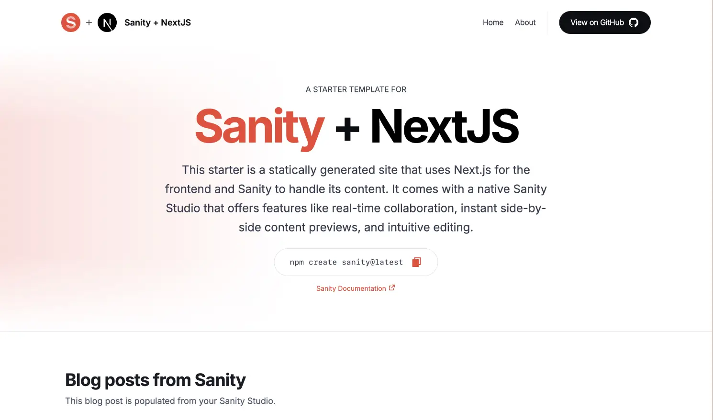
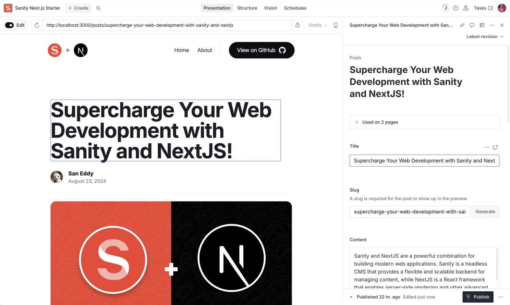

# A statically generated blog example using Next.js and Sanity




This starter is a statically generated blog that uses Next.js App Router for the frontend and [Sanity][sanity-homepage] to handle its content. It comes with a Sanity Studio that offers features like real-time collaboration and visual editing with live updates using [Presentation][presentation].

The Studio connects to Sanity Content Lake, which gives you hosted content APIs with a flexible query language, on-demand image transformations, powerful patching, and more. You can use this starter to kick-start a website, blog or learn these technologies.

## Features

- A performant, static Next.js website with pages and a blog.
  - Pages are configured with a page builder.
  - Blog posts with connected authors, and site settings.
- Visual editing with live updates through [Presentation](https://www.sanity.io/docs/presentation)
- TypeScript setup with [Sanity TypeGen](https://www.sanity.io/docs/sanity-typegen)
- A native and customizable authoring environment. You can [deploy and host the studio with Sanity](https://www.sanity.io/docs/deployment) or your hosting environment of choice.
- Real-time and collaborative content editing with fine-grained revision history
- Support for block content and the most advanced custom fields capability in the industry
- Incremental Static Revalidation; no need to wait for a rebuild to publish new content
- Unsplash integration setup for easy media management
- [Sanity AI Assist preconfigured for image alt text generation](https://www.sanity.io/docs/ai-assist?utm_source=github.com)

## Demo

### [https://next-blog.sanity.build](https://next-blog.sanity.build)

## Important files and folders

| File/Directory           | Description                                                   |
| ------------------------ | ------------------------------------------------------------- |
| **studio/**              |                                                               |
| `src/schemaTypes/`       | Directory where Sanity Studio content types are defined       |
| `env.local`              | Environment variables for local development                   |
| `sanity.cli.ts`          | Config file for Sanity CLI                                    |
| `sanity.config.ts`       | Sanity config                                                 |
| **nextjs-app/**          |                                                               |
| `app/[slug]/page.tsx`    | Route for a page                                              |
| `app/api/draft/route.ts` | Serverless route for triggering Draft mode                    |
| `app/components/`        | Shared components                                             |
| `app/posts/page.tsx`     | Route for a blog post                                         |
| `app/layout.tsx`         | Global layout for the app                                     |
| `app/page.tsx`           | Route for index page page                                     |
| `sanity/lib/client.ts`   | Sanity client configured based on `env.ts`                    |
| `sanity/lib/fetch.ts`    | Utility for fetching data from Sanity                         |
| `sanity/lib/queries.ts`  | GROQ queries used across the app                              |
| `env.local`              | Environment variables for local development                   |
| `sanity-typegen.json`    | TypeGen config                                                |
| `sanity.types.ts`        | Generated file of schema and query types                      |
| `tailwind.config.ts`     | Tailwind config. Only applies to files listed under `content` |

## Configure your Sanity Studio

### Step 1. Change directories to your Sanity Studio

```bash
cd studio
```

### Step 2. Install dependencies

```bash
npm install
```

### Step 3 Create a new Sanity project and dataset

```bash
npx sanity init --bare
```

You will be prompted with an output that contains the project ID and dataset name.

```bash
Success! Below are your project details:

Project ID: rjtcllfw
Dataset: production

You can find your project on Sanity Manage — https://www.sanity.io/manage/project/rjtcllfw
```

Your `projectI ID` is not sensitive information

### Step 4. Set up environment variables

```bash
cp -i .env.local.example .env.local
```

Next, populate the `.env.local` file with the project ID and dataset name provided by the Sanity CLI in the previous step, or by visiting the [Sanity Manage Console](https://manage.sanity.io/)

### Step 5. Optionally import the dataset

If you want to start with some sample content, you can import the provided dataset into your Sanity project. This step is optional but can be helpful for getting started quickly.

To import the dataset, run the following command in your terminal:

```bash
npx sanity dataset import production.tar.gz production
```

### Step 6. Run your Sanity Studio locally

At this point, when you run your Sanity Studio, you'll see a message indicating that Presentation needs to be configured.


We'll address this in the next section when we set up the Next.js app.

```bash
npm run dev
```

## Configure your Next.js app (Not using Vercel)

### Step 1. Change directories to your Next.js app

```bash
cd nextjs-app # from the root of the repo
```

### Step 2. Install dependencies

```bash
npm install
```

### Step 3. Set up environment variables

```bash
cp -i .env.local.example .env.local
```

Add your Sanity project details to the `.env.local` file. The `NEXT_PUBLIC_SANITY_PROJECT_ID` and `NEXT_PUBLIC_SANITY_DATASET`.

#### Creating a read token

Before you can run the project you need to setup a read token (`SANITY_API_READ_TOKEN`), it's used for authentication by Sanity's Presentation tool and pulling content while in draft mode.

1. Go to [manage.sanity.io](https://manage.sanity.io/) and select your project and select your project in "Project" dropdown.
2. Click on the `🔌 API` tab.
3. Click on `+ Add API token`.
4. Name it "NextJS / Presentation READ Token" and set `Permissions` to `Viewer` and hit `Save`.
5. Copy the token and add it to your `.env.local` file.

```bash
SANITY_API_READ_TOKEN="<paste your token here>"
```

### Step 4. Run your Next.js app locally

```bash
npm run dev
```

## Configure your Next.js app (Using Vercel)

### Step 1. Change directories to your Next.js app

```bash
cd nextjs-app
```

### Step 2. Set up the environment

Use the Deploy Button below. It will let you deploy the starter using [Vercel](https://vercel.com?utm_source=github&utm_medium=readme&utm_campaign=next-sanity-example) as well as connect it to your Sanity Content Lake using [the Sanity Vercel Integration][integration]. Assuming you setup a project in the previous step, you will be able to select your project when stepping through the wizard.

[][vercel-deploy]

### Step 3. Set up the project locally

[Clone the repository](https://docs.github.com/en/repositories/creating-and-managing-repositories/cloning-a-repository) that was created for you on your GitHub account. Once cloned, run the following command from the project's root directory:

```bash
npx vercel link
```

Download the environment variables needed to connect Next.js and the Studio to your Sanity project:

```bash
npx vercel env pull
```

This will create a git-ignored `.env` file with environment variables that will be used for local development.

### Step 4. Run Next.js locally in development mode

```bash
npm install && npm run dev
```

When you run this development server, the changes you make in your frontend and studio configuration will be applied live using hot reloading.

Your blog should be up and running on [http://localhost:3000][localhost-3000]!

### Step 5. Deploy to production

To deploy your changes to production you use `git`:

```bash
git add .
git commit
git push
```

Alternatively, you can deploy without a `git` hosting provider using the Vercel CLI:

```bash
npx vercel --prod
```

# Populate content

Open your Sanity Studio that should be running on [http://localhost:3000/studio](http://localhost:3000/studio).

By default you're taken to the [Presentation tool][presentation], which has a preview of the blog on the left hand side, and a list of documents on the right hand side.

<details>
<summary>View screenshot ✨</summary>


</details>

We're all set to do some content creation!

- Click on the **"+ Create"** button top left and select **Post**
- Type some dummy data for the **Title**
- **Generate** a **Slug**
  <details>
  <summary>Now that you have a slug you should see the post show up in the preview on the left hand side ✨</summary>

  

  </details>

- Fill in **Content** with some dummy text
  <details>
  <summary>Or generate it with AI Assist ✨</summary>

  If you've enabled [AI Assist][enable-ai-assist] you click on the sparkles ✨ button and generate a draft based on your title and then on **Generate sample content**.

  

  </details>

- Summarize the **Content** in the **Excerpt** field
  <details>
  <summary>Or have AI Assist summarize it for you ✨</summary>

  If you've enabled [AI Assist][enable-ai-assist] you click on the sparkles ✨ button and then on **Generate sample content**.

  

  </details>

- Select a **Cover Image** from [Unsplash].
  <details>
  <summary>Unsplash is available in the **Select** dropdown ✨</summary>

  

  </details>
  <details>
  <summary>Click the "Crop image" button to adjust hotspots and cropping ✨</summary>

  

  </details>
  <details>
  <summary>You can preview the results live on the left side, and additional formats on the right side ✨</summary>

  

  </details>

- Customize the blog name, description and more.
  <details>
  <summary>Click "Structure" at the top center, then on "Settings" on the left hand side ✨</summary>

  

  </details>
  <details>
  <summary>Once you have a "Settings" document, you can customize it inside "Presentation" ✨</summary>

  

  </details>

> [!IMPORTANT]  
> For each post record, you need to click **Publish** after saving for it to be visible outside Draft Mode. In production new content is using [Time-based Revalidation](https://nextjs.org/docs/app/building-your-application/data-fetching/fetching-caching-and-revalidating#time-based-revalidation), which means it may take up to 1 minute before changes show up. Since a stale-while-revalidate pattern is used you may need to refresh a couple of times to see the changes.

## Step 4. Deploy to production

> [!NOTE]  
> If you already [deployed with Vercel earlier](#deploy-your-own) you can skip this step.

To deploy your local project to Vercel, push it to [GitHub](https://docs.github.com/en/get-started/importing-your-projects-to-github/importing-source-code-to-github/adding-locally-hosted-code-to-github)/GitLab/Bitbucket and [import to Vercel](https://vercel.com/new?utm_source=github&utm_medium=readme&utm_campaign=next-example).

> [!IMPORTANT]  
> When you import your project on Vercel, make sure to click on **Environment Variables** and set them to match your `.env.local` file.

After it's deployed link your local code to the Vercel project:

```bash
npx vercel link
```

> [!TIP]
> In production you can exit Draft Mode by clicking on _"Back to published"_ at the top. On [Preview deployments](https://vercel.com/docs/deployments/preview-deployments) you can [toggle Draft Mode in the Vercel Toolbar](https://vercel.com/docs/workflow-collaboration/draft-mode#enabling-draft-mode-in-the-vercel-toolbar).

## Next steps

- [Join the Sanity community](https://slack.sanity.io/)

[vercel-deploy]: https://vercel.com/new/clone?repository-url=https%3A%2F%2Fgithub.com%2Fsanity-io%2Fsanity-template-nextjs-clean&repository-name=nextjs-sanity-clean&project-name=nextjs-sanity-clean&demo-title=Clean+Sanity+%2B+Next.js+app&demo-image=https%3A%2F%2Fuser-images.githubusercontent.com%2F835514%2F212771865-7a603a28-0416-45e8-84d3-2aafe02b0c7f.png&demo-description=A+clean+example+of+Next.js+with+embedded+Sanity+ready+for+recomposition.&demo-url=https%3A%2F%2Ftemplate-nextjs-clean.sanity.build&integration-ids=oac_hb2LITYajhRQ0i4QznmKH7gx&external-id=nextjs%3Btemplate%3Dnextjs-sanity-clean
[integration]: https://www.sanity.io/docs/vercel-integration
[`.env.local.example`]: .env.local.example
[unsplash]: https://unsplash.com
[sanity-homepage]: https://www.sanity.io?utm_source=github.com&utm_medium=referral&utm_campaign=nextjs-v3vercelstarter
[presentation]: https://www.sanity.io/docs/presentation
[enable-ai-assist]: https://www.sanity.io/plugins/ai-assist#enabling-the-ai-assist-api
